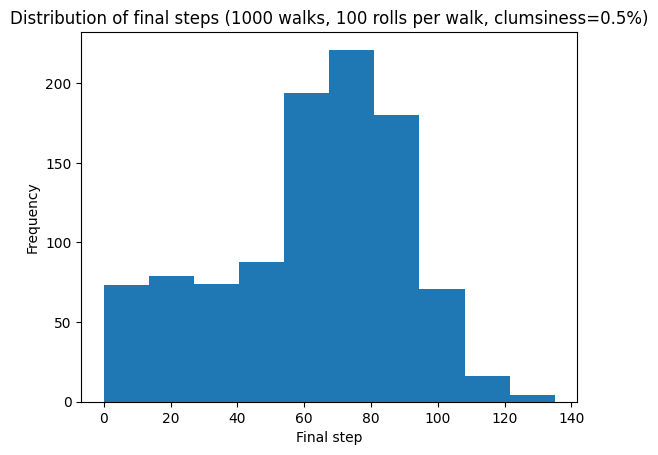
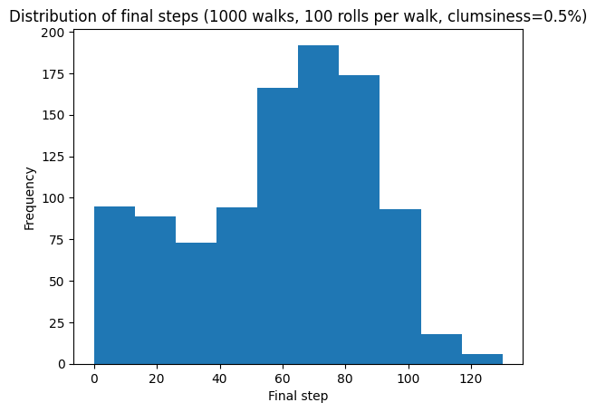
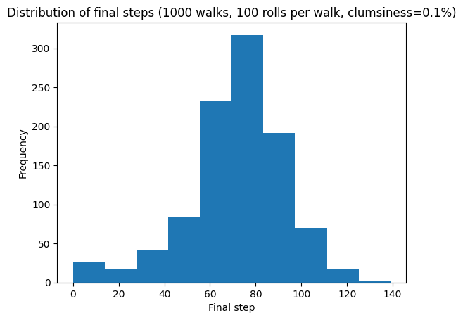
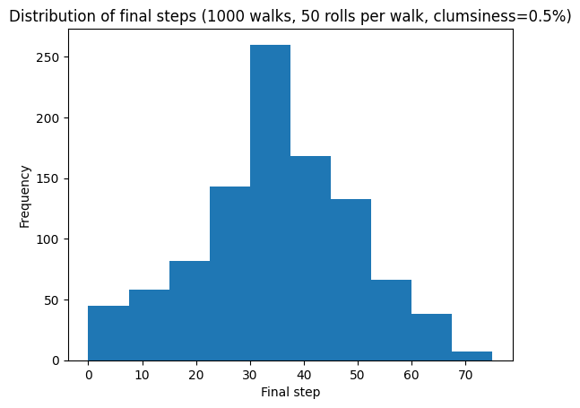
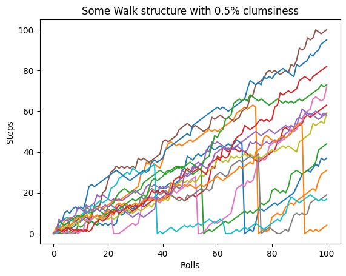
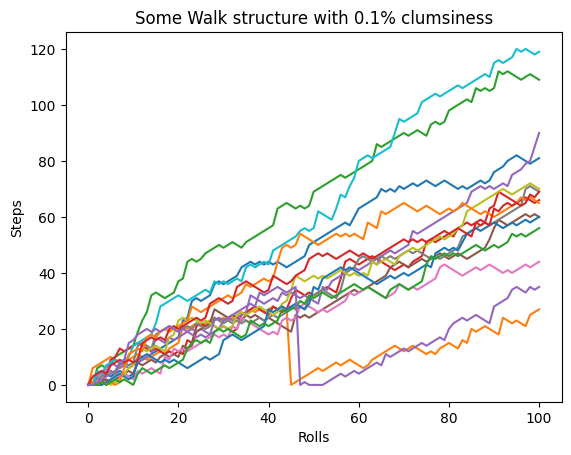

# Game simulation: climbing a building with a dice
### Random Walk Simulation and Analysis

Playing a game with a dice: up to which step of the staircase of a building can we go?

## Table of Contents
- [Description](#description)
- [Analysis Objectives](#analysis-objectives)
- [Repository Structure](#repository-structure)
- [Installation and Usage](#installation-and-usage)
- [Code Explanation](#code-explanation)
- [Key Insights](#key-insights)
- [Contact](#contact)

## Description
This project simulates and analyzes random walk process using Python. The simulation is a game, which consists on climbing the staircase of a building, betting if we can get to a certain step of the staircase with a certain amount of dice rolls with specific rules- for stepping forward, backward, or rolling again:

- If the dice results 1 or 2, go down a step
- If the dice results between 3 to 5, go up a step
- If the dice turns 6, roll again and go up the dice result.

A key feature is the inclusion of a "clumsiness" factor, where there's a small probability of falling back to the starting step 0. 
4 Parameters are given to the user in order to explore an analyse different scenarios:

   Parameter N°1: `limit_step`step we are aiming to reach
   
   Parameter N°2: `num_rolls` number of time the dice will be roll
   
   Parameter N°3: `clumsiness` clumsiness, a probability of falling while climbing up the stairs
   
   Parameter N°4: `total_walks` The total number of random walks simulated.

If we give the code a big number of `total_walks`, we can get a clear probability of reaching the `limit_step` on the given context. The project returns this probabilty, and also explores the distribution of final steps after a set number of rolls and visualizes individual walk trajectories.

## Analysis Objectives
The main objectives of this analysis are:
1.  To simulate a large number of random walks under defined rules, including the clumsiness factor.
2.  To analyze the distribution of the final step reached after a fixed number of rolls.
3.  To calculate the empirical probability of reaching or exceeding a specific step limit.
4.  To visualize the trajectories of individual random walks to understand their behavior.
5.  To study the impact of simulation parameters (like the number of rolls, number of walks, and clumsiness probability) on the results.


## Repository Structure

```
Game_simulation-_climbing_a_building_with_a_dice  ├── README.md 
                                                  ├── notebook.ipynb # Your Jupyter Notebook file 
                                                  ├── script # separate script
                                                  ├── requirements.txt # required libraries
                                                  └── images/ # Directory for plots and figures 
                                                       ├── Walk_structure_0.1_100.png 
                                                       ├── Walk_structure_0.5_100.png
                                                       ├── fs_dist_1000_100_0.1_70.png
                                                       ├── fs_dist_1000_100_0.5_60.png
                                                       ├── fs_dist_1000_100_0.5_70.png  
                                                       └── fs_dist_1000_50_0.5_60.png  
                                         
```

## Installation and Usage
To run this notebook or script locally, you will need Python installed. It is recommended to use a virtual environment.

1.  Clone the repository:
    ```bash
    git clone https://github.com/josearevalobezic/Game_simulation-_climbing_a_building_with_a_dice.git
    cd Game_simulation-_climbing_a_building_with_a_dice
    ```
2.  Install the required libraries. If you have a `requirements.txt` file, you can do this with pip:
    ```bash
    pip install -r requirements.txt
    ```
    Otherwise, install `numpy` and `matplotlib` manually:
    ```bash
    pip install numpy matplotlib
    ```

You can interact with the analysis in two ways:

1.  **Using the Jupyter Notebook:** Open the `notebook.ipynb` file in a Jupyter environment (like JupyterLab, Jupyter Notebook, or Google Colab). You can run the cells sequentially to see the simulations and visualizations.
2.  **Running the Python Script:** Execute the `script.py` file from your terminal:
    ```bash
    python script.py
    ```
    This will run the simulations and display or save the generated plots.

Feel free to modify the parameters within the notebook or script to explore different scenarios.

## Code Explanation
The core logic is implemented in the `random_walk.py` file with the following main components:
- `simulate_random_walk(num_rolls)`: Simulates a single walk for `num_rolls` steps, applying the dice rules and the clumsiness factor. It returns a list representing the steps taken in the walk.
- `run_simulation(total_walks, num_rolls)`: Executes `total_walks` number of `simulate_random_walk` calls and returns a NumPy array containing all walk trajectories.
- `analyze_random_walk(all_walks_array)`: Takes the array of all walks, analyzes the final steps, generates a histogram of the final step distribution, and prints the probability of exceeding the `limit_step`.
- `fifteen_walks(all_walks_array)`: Plots the trajectories of 15 simulated walks to visualize individual paths.

## Key Insights


- The distribution of final steps tends to be concentrated around a certain range, but with significant spread due to the random nature of the process.

  


*Probability of finishing on or above the step 60 (1000 walks, 100 rolls per walk, clumsiness=0.5%): 61%*


- The "clumsiness" factor significantly impacts the probability of reaching higher steps, as falls reset progress.



*Probability of finishing on or above the step 70 (1000 walks, 100 rolls per walk, clumsiness=0.5%): 40%*



*Probability of finishing on or above the step 70 (1000 walks, 100 rolls per walk, clumsiness=0.1%): 59.9%*


  
- Increasing the number of rolls generally shifts the distribution of final steps towards higher values, but also increases variability.



*Probability of finishing on or above the step 60 (1000 walks, 50 rolls per walk, clumsiness=0.5%): 45%*

  
- Even with a small clumsiness probability, a notable percentage of walks may end at step 0.





## Contact
[José Arévalo Bezic] - [jarevalobezic@gmail.com] - [https://github.com/josearevalobezic] - [www.linkedin.com/in/jarevalo-bezic]

